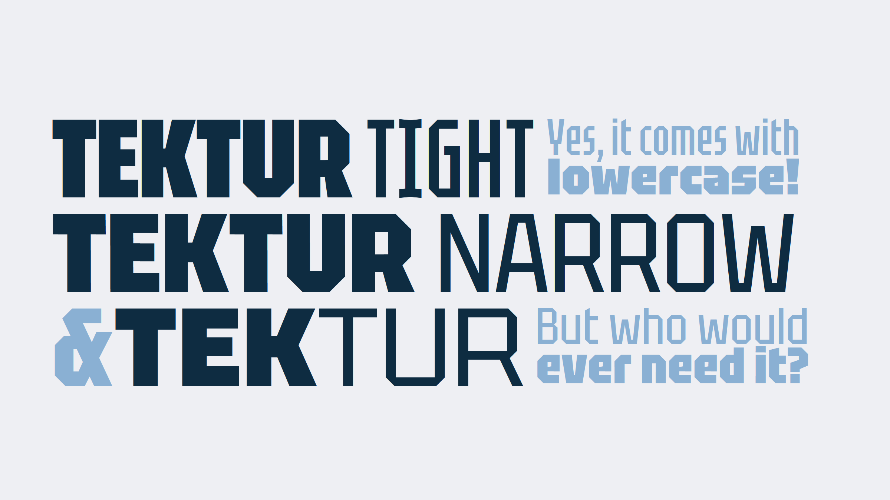

**Tektur** is a constructed typeface featuring octagonal outlines and rectangular counters. This rudimentary principle is applied where rounds are typically found, but most of the diagonals are left intact which helps preserve good readability and a familiar stance. The x-height is set high and ascenders are aligned with the cap height allowing for compact typesetting.

The Tektur static font family comprises three widths (Tight, Narrow, normal) in 6 weights (Regular, Medium, SemiBold, Bold, ExtraBold, Black), giving a wide design range useful for many applications. The variable version has width locations renamed (Condensed, SemiCondensed, Normal) for compliance with Google recommendations. The typeface was designed and developed by Adam Jagosz.

## Tags
square, squarish, mechanical, angular, blocky, blockish, octagonal, rectangular, sharp, technical, techno, industrial, modern, retro, computer, constructivist, decorative, geometric, machine, masculine, narrow, condensed, tall, tight, display, poster, sans-serif, monoline